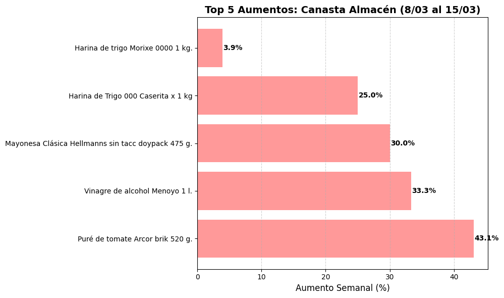

# Argentine Inflation Tracker (Carrefour Edition) 🇦🇷

## Project Overview
This project focuses on tracking price dynamics in Argentina by scraping data from major grocery retailers. In a high-inflation environment, traditional monthly reports often lag behind real-time market shifts. This tool provides a more granular view of price volatility.

## Technical Implementation
- **Language:** Python
- **Libraries:** Selenium, BeautifulSoup, Pandas
- **Methodology:** Weekly data extraction from the "Almacén" section of Carrefour Argentina to calculate Week-over-Week (WoW) variation.

## Current Status: 🏗️ In Development
- **[March 8, 2026]:** Initial script deployment and first data capture completed (Baseline).
- ### Update: Week 2 **(March 15, 2026)**
Successfully completed the second data collection and performed a comparative analysis.

**Key Findings:**
* **Weekly Inflation Rate:** 2.07% (average for the 'Almacén' category).
* **Sample Size:** 50 consistent products compared between March 8 and March 15.
* **Analysis:** While the average remains stable, high price dispersion was detected, with specific items recording spikes over 30% due to the expiration of seasonal promotions.

- ### **Update: Week 3 (March 22, 2026)**
Third scrape. Now with 3 data points I could calculate cumulative inflation for the first 15 days of March.
Results (W1 → W3, using promotional price):

Products matched: 49
Cumulative inflation: -0.16%

That negative number looked weird, so I dug into the distribution:

35 out of 49 products had zero price change
8 went down, 6 went up
The "decreases" were huge swings (-28%, -25%) from big brands like Maggi and Savora — clearly promotions, not deflation

 ## switching to List Price
This is where things got interesting. Carrefour's API actually returns two price fields:

Price — what you pay at checkout (includes active discounts)
List Price — the official shelf price before any promotion

When I redid the W1 → W3 comparison using List Price instead of Price, the results changed significantly:

| Metric | Promo Price | List Price |
|---|---|---|
| Cumulative inflation (15 days) | -0.16% | **+0.35%** |
| Products that went down | 8 | 2 |
| No change | 35 | 42 |

This is why the updated script (InflationProject_v2.ipynb) now saves both columns from the start.

now we have : | `InflationProyect.ipynb` | Original notebook — shows the full learning process, bugs and all |
| `InflationProject_v2.ipynb` | Improved version — English outputs, fixed calculation, List Price tracking |

- **[Upcoming]:** price variation analysis scheduled for next week.

